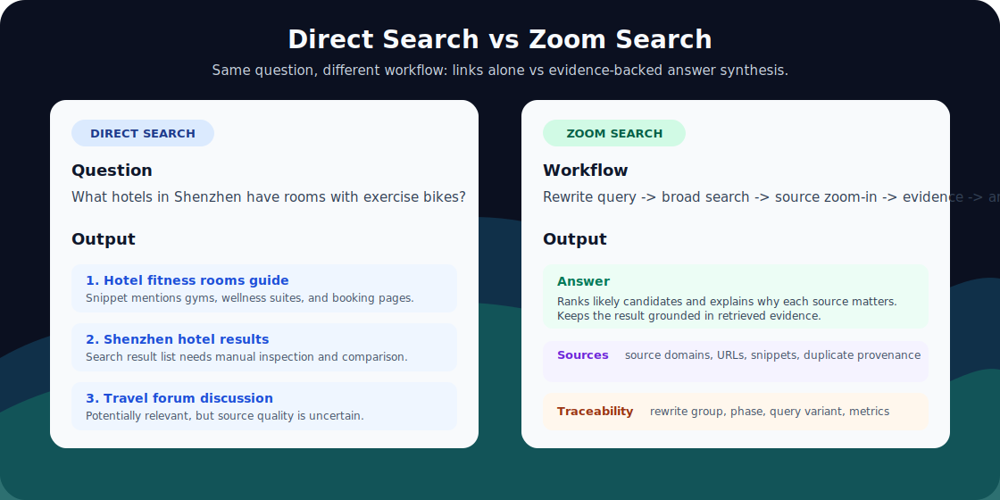
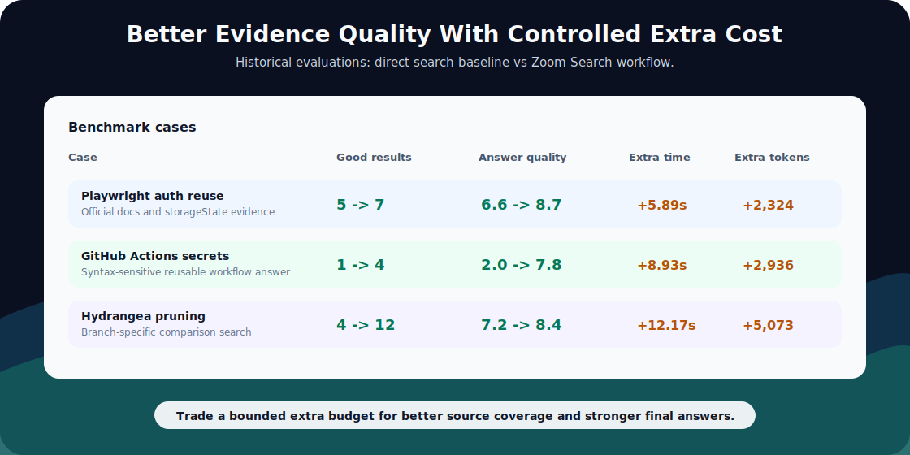

# Zoom Search

<p align="center">
  
</p>

<p align="center">
  =3.10" />
  
  
  
</p>

<p align="center">
  <a href="#quickstart">Quickstart</a> ·
  <a href="#real-provider-example">Providers</a> ·
  <a href="#common-parameters">Parameters</a> ·
  <a href="./docs/benchmarks.md">Benchmarks</a> ·
  <a href="./docs/advanced-configuration.md">Advanced Configuration</a> ·
  <a href="./docs/development.md">Development</a>
</p>

Zoom Search is a precise AI web search library for Python. It rewrites questions, searches broadly, zooms into high-value source domains, deduplicates results, formats evidence, and can synthesize sourced answers through an async API.

It is built for applications that need stronger source discovery, traceability, and answer grounding than a single search call.

## Why Zoom Search

- **Zoom-out then zoom-in**: discover broad sources first, then search targeted domains for stronger evidence.
- **Traceable results**: preserve rewrite groups, source domains, duplicate provenance, warnings, and metrics.
- **Provider-flexible**: use built-in LLM/search engines or custom OpenAI-compatible and native HTTP endpoints.
- **Demo-friendly**: run deterministic local examples with `demo_mode=True` and no API keys.

## Workflow

1. Normalize a `SearchRequest`, request dictionary, or flat keyword parameters.
2. Resolve LLM and search providers from capability declarations.
3. Rewrite the question into structured search groups and query variants.
4. Run broad zoom-out searches.
5. Select high-value source domains.
6. Run targeted zoom-in searches on those domains.
7. Deduplicate results and preserve traceability.
8. Format evidence and optionally synthesize an answer.

## Requirements

- Python `>=3.10`
- `httpx>=0.27.0`
- `uv` recommended for development

<p align="center">
  
</p>

<p align="center">
  
</p>

<p align="center">
  
</p>

Benchmark notes: https://github.com/goofrey/zoom-search/blob/main/docs/benchmarks.md

## Install

With pip:

```bash
pip install zoom-search
```

With uv:

```bash
uv add zoom-search
```

For development:

```bash
uv sync
```

## Example Queries

- What hotels in Shenzhen have rooms with exercise bikes?
- Which vector databases support hybrid search and metadata filtering for Python apps?
- What are the latest SQLite performance improvements and what versions introduced them?
- Which AI coding tools support self-hosted deployment for enterprise teams?
- What are the differences between Tavily, Brave Search API, and Serper for AI search apps?

## Examples

Runnable examples are available in the `examples/` directory:

```bash
python examples/demo_mode.py
python examples/streaming.py
python examples/conversation_history.py
```

## Quickstart

```python
import asyncio

from zoom_search import search


async def main() -> None:
    response = await search(
        question="What hotels in Shenzhen have rooms with exercise bikes?",
        demo_mode=True,
        output_mode="answer_with_sources",
        seed=7,
    )
    print(response.answer)
    print(response.results)
    print(response.metrics)


asyncio.run(main())
```

## Conversation History

Use `previous_conversation` when the latest question depends on recent context. Zoom Search keeps the latest two non-empty entries and uses them during query rewriting and answer synthesis.

```python
import asyncio

from zoom_search import search


async def main() -> None:
    response = await search(
        question="What about hotels with in-room fitness equipment?",
        previous_conversation=[
            "I am planning a business trip to Shenzhen.",
            "I prefer hotels with wellness facilities.",
        ],
        demo_mode=True,
        output_mode="answer_with_sources",
    )
    print(response.answer)


asyncio.run(main())
```

## Real Provider Example

```python
import asyncio

from zoom_search import search


async def main() -> None:
    response = await search(
        question="Which is better, Python or Java for web development?",
        llm_engine="gemini",
        llm_model="gemini-2.5-flash",
        llm_api_key="YOUR_GEMINI_API_KEY",
        search_engine="tavily",
        search_api_key="YOUR_TAVILY_API_KEY",
        output_mode="answer_with_sources",
    )
    print(response.answer)
    print(response.search_context)


asyncio.run(main())
```

## Streaming

```python
import asyncio

from zoom_search import astream_search


async def main() -> None:
    async for event in astream_search(
        question="What hotels in Shenzhen have rooms with exercise bikes?",
        demo_mode=True,
        output_mode="answer_with_sources",
        seed=7,
    ):
        if event.type == "answer_delta":
            print(event.text, end="")
        if event.type == "completed":
            print(event.response.request_id)


asyncio.run(main())
```

Answer modes emit `search_started`, `search_completed`, `answer_started`, `answer_delta`, `answer_completed`, and `completed`.

| Event | When it appears |
|---|---|
| `search_started` | The workflow has accepted and normalized the request. |
| `search_completed` | Search, zoom-in, deduplication, and evidence formatting are complete. |
| `answer_started` | LLM answer synthesis is about to start. |
| `answer_delta` | A streamed answer text chunk is available. |
| `answer_completed` | Answer synthesis has finished. |
| `completed` | The final `SearchResponse` is available on the event. |

## Common Parameters

Top-level parameters:

| Parameter | Description |
|---|---|
| `question` | User question to search and answer. |
| `previous_conversation` | Recent context strings; only the latest two non-empty entries are kept. |
| `output_mode` | `answer`, `answer_with_sources`, `results_simple`, or `results_detailed`. |
| `demo_mode` | Use deterministic local demo providers without API keys. |
| `seed` | Reproducibility hint for demo mode and supported LLM providers. |
| `http_proxy` | Global provider proxy URL. |

LLM parameters:

| Parameter | Description |
|---|---|
| `llm_engine` | Built-in engine name, `openai-compatible`, or `custom`. |
| `llm_model` | Model name passed to the selected LLM provider. |
| `llm_api_key` | API key for the LLM provider. |
| `llm_base_url` | Custom or OpenAI-compatible LLM endpoint base URL. |
| `llm_headers` | Additional request headers for the LLM provider. |
| `llm_http_proxy` | LLM-specific proxy URL. |
| `llm_extra` | Provider-specific mapping or adapter options. |
| `llm_request_options` | Optional feature flags for `temperature`, `response_format`, `seed`, `stream`, and `reasoning`. |

Search parameters:

| Parameter | Description |
|---|---|
| `search_engine` | Built-in search engine name or `custom`. |
| `search_api_key` | API key for the search provider. |
| `search_base_url` | Custom search endpoint URL. |
| `search_headers` | Additional request headers for the search provider. |
| `search_http_proxy` | Search-specific proxy URL. |
| `search_extra` | Provider-specific search options. |
| `search_result_collection_path` | Dot path to the result list for custom search responses. |
| `search_title_fields` | Candidate title fields for custom search result mapping. |
| `search_snippet_fields` | Candidate snippet fields for custom search result mapping. |
| `search_url_fields` | Candidate URL fields for custom search result mapping. |

Search limits:

| Parameter | Default | Description |
|---|---:|---|
| `zoomout_num_results` | `5` | Broad search result count per query. |
| `zoomin_num_results` | `5` | Domain-focused search result count. |
| `top_k_domains_per_query` | `1` | Number of source domains selected for zoom-in search. |

## Output Modes

| Mode | Use case |
|---|---|
| `answer` | Return synthesized answer only. |
| `answer_with_sources` | Return answer, sources, search context, metrics, and warnings. |
| `results_simple` | Return normalized search results without answer synthesis. |
| `results_detailed` | Return results with source domains, traceability, and duplicate provenance. |

## Features

- `search(...)`: run the full workflow and return a `SearchResponse`.
- `astream_search(...)`: stream answer synthesis events after search completes.
- `demo_mode=True`: deterministic local demo with no API keys.
- Built-in LLM and search providers plus custom OpenAI-compatible or native HTTP providers.
- Output modes for answer-only, answer-with-sources, simple results, and detailed traceability.
- Structured metrics, warnings, duplicate provenance, and stable error types.

## Built-In Engines

Built-in `llm_engine` options:

`openai`, `gemini`, `doubao-global`, `doubao-china`, `qwen-global`, `qwen-china`, `glm-china`, `glm-global`, `baichuan`, `spark`, `huggingface`, `claude`, `replicate`, `minimax-global`, `minimax-china`, `deepseek`, `kimi-china`, `kimi-global`, `yi`, `hunyuan`, `stepfun`, `siliconflow`, `together`, `fireworks`, `groq`, `cerebras`, `perplexity`, `grok`, `mistral`, `cohere`, `openrouter`, `mimo`, `deepinfra`, `novita`, `hyperbolic`, `lepton`, `ollama`, `openai-compatible`, `custom`.

Built-in `search_engine` options:

`tavily`, `serper`, `brave`, `you`, `360search`, `firecrawl`, `baidu`, `linkup`, `perplexity`, `glm`, `volcengine`, `exa`, `bocha`, `querit`, `serpapi`, `metasota`, `searxng`, `tiangong`, `custom`.

## Documentation

- Advanced configuration: https://github.com/goofrey/zoom-search/blob/main/docs/advanced-configuration.md
- Development checks: https://github.com/goofrey/zoom-search/blob/main/docs/development.md

## Development

```bash
# Run tests with uv.
uv run pytest
```

See [docs/development.md](./docs/development.md) for evaluation assets and additional checks.

## License

Zoom Search is open source under the [MIT License](./LICENSE).
