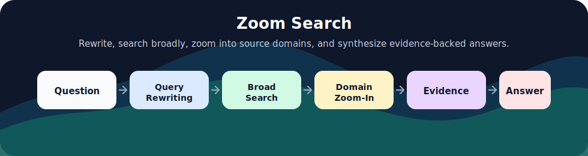
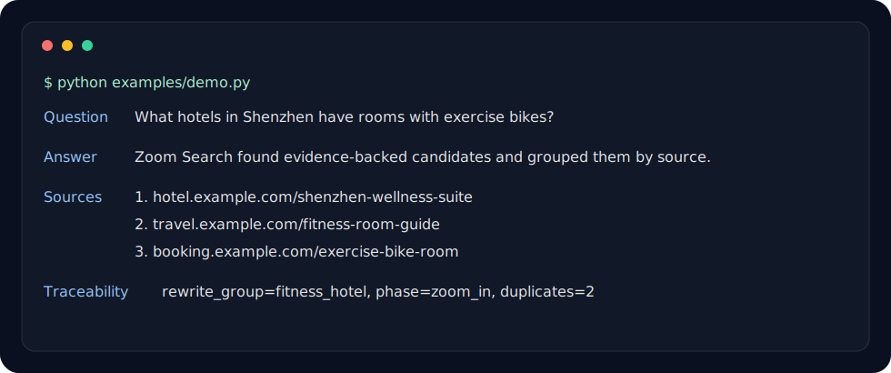

# Zoom Search

<p align="center">
  
</p>

<p align="center">
  =3.10" />
  
  
  
</p>

<p align="center">
  <a href="#quickstart">Quickstart</a> ·
  <a href="#real-provider-example">Providers</a> ·
  <a href="./docs/advanced-configuration.md">Advanced Configuration</a> ·
  <a href="./docs/development.md">Development</a>
</p>

Zoom Search is a precise AI web search library for Python. It rewrites questions, searches broadly, zooms into high-value source domains, deduplicates results, formats evidence, and can synthesize sourced answers through an async API.

It is built for applications that need stronger source discovery, traceability, and answer grounding than a single search call.

## Why Zoom Search

- **Zoom-out then zoom-in**: discover broad sources first, then search targeted domains for stronger evidence.
- **Traceable results**: preserve rewrite groups, source domains, duplicate provenance, warnings, and metrics.
- **Provider-flexible**: use built-in LLM/search engines or custom OpenAI-compatible and native HTTP endpoints.
- **Demo-friendly**: run deterministic local examples with `demo_mode=True` and no API keys.

## Workflow

1. Normalize a `SearchRequest`, request dictionary, or flat keyword parameters.
2. Resolve LLM and search providers from capability declarations.
3. Rewrite the question into structured search groups and query variants.
4. Run broad zoom-out searches.
5. Select high-value source domains.
6. Run targeted zoom-in searches on those domains.
7. Deduplicate results and preserve traceability.
8. Format evidence and optionally synthesize an answer.

## Requirements

- Python `>=3.10`
- `httpx>=0.27.0`
- `uv` recommended for development

<p align="center">
  
</p>

## Install

With pip:

```bash
pip install zoom-search
```

With uv:

```bash
uv add zoom-search
```

For development:

```bash
uv sync
```

## Quickstart

```python
import asyncio

from zoom_search import search


async def main() -> None:
    response = await search(
        question="What hotels in Shenzhen have rooms with exercise bikes?",
        demo_mode=True,
        output_mode="answer_with_sources",
        seed=7,
    )
    print(response.answer)
    print(response.results)
    print(response.metrics)


asyncio.run(main())
```

## Real Provider Example

```python
import asyncio

from zoom_search import search


async def main() -> None:
    response = await search(
        question="Which is better, Python or Java for web development?",
        llm_engine="gemini",
        llm_model="gemini-2.5-flash",
        llm_api_key="YOUR_GEMINI_API_KEY",
        search_engine="tavily",
        search_api_key="YOUR_TAVILY_API_KEY",
        output_mode="answer_with_sources",
    )
    print(response.answer)
    print(response.search_context)


asyncio.run(main())
```

## Streaming

```python
import asyncio

from zoom_search import astream_search


async def main() -> None:
    async for event in astream_search(
        question="What hotels in Shenzhen have rooms with exercise bikes?",
        demo_mode=True,
        output_mode="answer_with_sources",
        seed=7,
    ):
        if event.type == "answer_delta":
            print(event.text, end="")
        if event.type == "completed":
            print(event.response.request_id)


asyncio.run(main())
```

Answer modes emit `search_started`, `search_completed`, `answer_started`, `answer_delta`, `answer_completed`, and `completed`.

## Features

- `search(...)`: run the full workflow and return a `SearchResponse`.
- `astream_search(...)`: stream answer synthesis events after search completes.
- `demo_mode=True`: deterministic local demo with no API keys.
- Built-in LLM and search providers plus custom OpenAI-compatible or native HTTP providers.
- Output modes for answer-only, answer-with-sources, simple results, and detailed traceability.
- Structured metrics, warnings, duplicate provenance, and stable error types.

## Built-In Engines

Built-in `llm_engine` options:

`openai`, `gemini`, `doubao-global`, `doubao-china`, `qwen-global`, `qwen-china`, `glm-china`, `glm-global`, `baichuan`, `spark`, `huggingface`, `claude`, `replicate`, `minimax-global`, `minimax-china`, `deepseek`, `kimi-china`, `kimi-global`, `yi`, `hunyuan`, `stepfun`, `siliconflow`, `together`, `fireworks`, `groq`, `cerebras`, `perplexity`, `grok`, `mistral`, `cohere`, `openrouter`, `mimo`, `deepinfra`, `novita`, `hyperbolic`, `lepton`, `ollama`, `openai-compatible`, `custom`.

Built-in `search_engine` options:

`tavily`, `serper`, `brave`, `you`, `360search`, `firecrawl`, `baidu`, `linkup`, `perplexity`, `glm`, `volcengine`, `exa`, `bocha`, `querit`, `serpapi`, `metasota`, `searxng`, `tiangong`, `custom`.

## Documentation

- Advanced configuration: [docs/advanced-configuration.md](./docs/advanced-configuration.md)
- Development checks: [docs/development.md](./docs/development.md)

## Development

```bash
# Run tests with uv.
uv run pytest
```

See [docs/development.md](./docs/development.md) for evaluation assets and additional checks.

## License

Zoom Search is open source under the [MIT License](./LICENSE).
